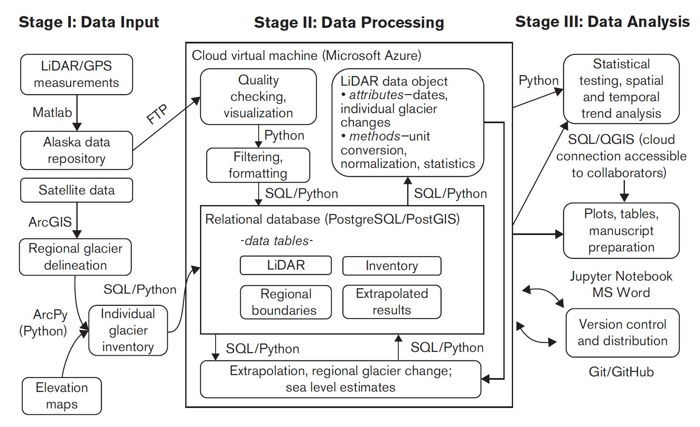

# Overview

This code processes and analyzes [IceBridge Alaska](https://www.nasa.gov/image-feature/operation-icebridge-exploring-alaska-s-mountain-glaciers) Altimetry data.

## Project lead: 

[Chris Larsen](mailto:cflarsen@alaska.edu)

## Code Developers:

[Anthony Arendt](mailto:arendta@uw.edu), Evan Burgess, Christian Kienholz

## Workflow

#### Reference:

C. Larsen, E. Burgess, A. Arendt, S. O'Neel, A. Johnson, and C. Kienholz (2015). Surface melt dominates Alaska glacier mass balance. _Geophysical Research Letters_, pp. 5902-5908. ISSN: 00948276. DOI:
[10.1002/2015GL064349](https://agupubs.onlinelibrary.wiley.com/doi/full/10.1002/2015GL064349).

Kitzes, Justin, Daniel Turek, and Fatma Deniz, eds. The practice of reproducible research: case studies and lessons from the data-intensive sciences. [Univ of California Press, 2017.](https://books.google.com/books?hl=en&lr=&id=NDEyDwAAQBAJ&oi=fnd&pg=PR11&ots=xB91HIAONr&sig=YS0c8fgiyr93Js1ryS9QvJ9--4M#v=onepage&q&f=false)
